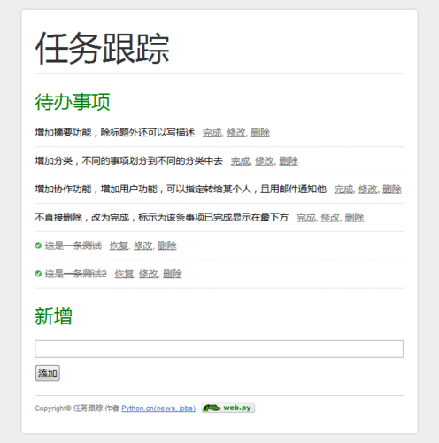

# python-simple-todo

                    
为什么要写这个教程呢？非常多的新手问同样的问题，很烦恼。我并不打算写得大而全，我只想写一个简单的入门级的，解决新手的烦恼，其他知识你需要看官方文档。我写了一个简单的 todo 程序，供新手学习和参考。

<a href="README_images/large.png" target="_blank">查看100%效果图 &gt;</a>&nbsp;来看源代码的？直接拉到最后。

<h2>安装python的web.py框架</h2>

单击这里<a href="http://webpy.org/static/web.py-0.21.tar.gz" target="_blank">下载web.py</a>的安装文件，将下载得到的文件web.py-0.21.tar.gz 解压，进入解压后的文件夹，在命令行下执行：python setup.py install，在Linux 等系统下，需要root 的权限，可以执行：sudo python setup.py install。

<h2>新人的烦恼</h2>

许多新手，特别是从 ASP/PHP/JSP 转过来的同学，经常问下面这几个问题：

<ul>
	<li>所有东西都放在一个 code.py 中呀？我有好多东西该如何部署我的代码？</li>
	<li>是不是 /index 对应访问目录下的 /index.py？</li>
	<li>我想要PHP中的那个 include，在模板该怎么实现？</li>
	<li>我输出的内容为什么是纯文本的？我输入的是 Html，原样输出了哦。</li>
</ul>

嗯，我很理解，我当初也一样遇到，原因是我们对 Python 的基础工作原理不熟悉。Python 中有一个包机制，也就是说 code.py 中的东西都可以独立出来，做为一个模块或一个包存在，你需要什么就导入什么。例如 url 的配置，你可以独立成一个 url.py 的文件，这样你把 url 配置写在这里，在 code.py 中导入即可。

不是 /index 对应访问 /index.py 的，在 web.py 中，是对应后面的类。在 web.py 中，绝大部分是没有写死的，只有 GET 和 POST 是写死的。

<h2>工作文件目录看起来是如何的？</h2>

这是我的文件结构，不代表其他同学。

<blockquote>

|-- code.py 
|-- config/ 
|&nbsp;&nbsp; |-- __init__.py 
|&nbsp;&nbsp; |-- settings.py 
|&nbsp;&nbsp; `-- url.py 
|-- controllers/ 
|&nbsp;&nbsp; |-- __init__.py 
|&nbsp;&nbsp; `-- todo.py 
|-- static/ 
|&nbsp;&nbsp; |-- images/ 
|&nbsp;&nbsp; `-- styles/ 
|&nbsp;&nbsp;&nbsp;&nbsp;&nbsp;&nbsp; |-- index/ 
|&nbsp;&nbsp;&nbsp;&nbsp;&nbsp;&nbsp; |&nbsp;&nbsp; |-- images/ 
|&nbsp;&nbsp;&nbsp;&nbsp;&nbsp;&nbsp; |&nbsp;&nbsp; |&nbsp;&nbsp; `-- website.png 
|&nbsp;&nbsp;&nbsp;&nbsp;&nbsp;&nbsp; |&nbsp;&nbsp; `-- style.css 
|&nbsp;&nbsp;&nbsp;&nbsp;&nbsp;&nbsp; `-- reset.css 
`-- templates/ 
&nbsp;&nbsp;&nbsp; |-- error.html 
&nbsp;&nbsp;&nbsp; |-- foot.html 
&nbsp;&nbsp;&nbsp; |-- header.html 
&nbsp;&nbsp;&nbsp; |-- index.html 
&nbsp;&nbsp;&nbsp; `-- todo/ 
&nbsp;&nbsp;&nbsp;&nbsp;&nbsp;&nbsp;&nbsp; `-- edit.html

# 使用 <a href="http://simple-is-better.com/project/ulipad" target="_blank">Ulipad</a> 的 目录树打印 功能输出，也是好用的python编辑器。

</blockquote>

<h2>他们如何工作？</h2>

code.py 主要用于启动，绝大部分时候它是没有用的。

/static 这个是静态文件目录，在内置的开发服务器上不可以修改，如果你使用其他 web server 来配置的是可以改的。

/controllers 控制层的代码，或者实际工作的代码就在这里。

__init__.py 这是用来做什么的？看起来像初始化？嗯… 如果你希望某个目录可以被引用，加上这个一样空白文件就好了，表示当前是一个模块可以被引用。这是给新手做的说明。

/config 一些常用配置，我把 url 的配置独立出来了，因为项目做大了，url 很长。

我取消了 model 层，不要问我为什么，这是一个很纠结的话题，如果你需要，你可以独立出一个 model 层。

其他的应该不用解释了。

<h2>简单说一下 url 的配置</h2>

<blockquote>

pre_fix = 'controllers.'

urls = ( 
&nbsp;&nbsp;&nbsp; '/',&nbsp;&nbsp;&nbsp;&nbsp;&nbsp;&nbsp;&nbsp;&nbsp;&nbsp;&nbsp;&nbsp;&nbsp;&nbsp;&nbsp;&nbsp;&nbsp;&nbsp;&nbsp;&nbsp; pre_fix + 'todo.Index', 
&nbsp;&nbsp;&nbsp; '/todo/new',&nbsp;&nbsp;&nbsp;&nbsp;&nbsp;&nbsp;&nbsp;&nbsp;&nbsp;&nbsp;&nbsp; pre_fix + 'todo.New', 
&nbsp;&nbsp;&nbsp; '/todo/(\d+)',&nbsp;&nbsp;&nbsp;&nbsp;&nbsp;&nbsp;&nbsp;&nbsp;&nbsp; pre_fix + 'todo.View', 
&nbsp;&nbsp;&nbsp; '/todo/(\d+)/edit',&nbsp;&nbsp;&nbsp;&nbsp; pre_fix + 'todo.Edit', 
&nbsp;&nbsp;&nbsp; '/todo/(\d+)/delete',&nbsp;&nbsp; pre_fix + 'todo.Delete',

)

</blockquote>

原理前面说过了，前面的访问地址对应后面的方法路径。好多重复的字符串，所以我就把前面的弄成一个变量了。

大部分时候简单的正则可以适用你的常规应用了，数字用 (\d+)，字符串用 (.*) 。

<h2>新手科普</h2>

<blockquote>

#!/usr/bin/env python 
# coding: utf-8

</blockquote>

程序文件中请确保有这两行开头，你读过简明教程，对吧？你应该懂的。第一行表示在 *nix 下面，使用 python 来解释当前程序；第二行表示当前文件编码为 utf-8。

<h2>程序老是报编码错误</h2>

数据库、程序文件等，请全部使用 utf-8 编码。

经常遇到程序编码错误？web.py 内部默认使用 unicode，经过 web.py 处理过的都是 unicode，所以你如果有中文，尝试转为 unicode，比如 a = u'中文啊'。大部分情况下可能解决。

<h2>开发服务器加载CSS文件非常慢</h2>

请统一换行符，即文件格式问题，全部使用 Unix 风格的换行符。可能是你的 CSS 是 win 格式的编码，请改为 Unix 编码。

<h2>关于 static 静态文件目录</h2>

默认 webserver 开发模式下，不可改名，不可改路径。你要是拖了自己的其他 &nbsp;webserver，那你自己另外配，当然可以是任何名字。

<h2>类似 PHP 中的 include 引用在模板中如何实现？</h2>

把 render 做为全局变量放到模板中去，然后 $:render.header() 这样。同样本示例源码中也使用了该方式，而没有使用 layout 方式，该方式看官方文档。

<h2>$news.content 纯文本输出了啊？</h2>

这样 $:news.content

<h2>关于 web.input()</h2>

i = web.input() # get，post 提交的数据通收。

<h2>title = i.get('title', None) 这是什么意思？</h2>

从 i 中取 title，如果没有取到则将 title 赋值 None。不然，你直接 title = i.title 如果前面的表单中没有这一项会报错。

<h2>关于&nbsp;db.select 返回的是列表</h2>

<blockquote>

a = db.select(tb, where='id=$id', vars=locals())&nbsp; # id 为自增的那个主键

</blockquote>

select 返回的是一个列表，因此要 a[0] 取到第 1 条。不过你有经验的话，接下去仍然要判断下：

<blockquote>

if not a: 
&nbsp;&nbsp;&nbsp; return '没有找到结果…' 
return a[0]

</blockquote>

<h2>QA 得差不多了，请阅读源代码，web.py 中文教程</h2>

读代码最实际，对吧？项目主页：

github:&nbsp;<a href="https://github.com/forthxu/python-simple-todo">https://github.com/forthxu/python-simple-todo</a>

数据文件在 <code>/static/sql</code> 下面，请自行导入，默认使用了 mysql，需要可以修改成其他数据库，在 <code>/config/settings.py</code> 中修改配置。

请放心，源码是可以直接工作的，可以直接在目录下 code.py 即可。其中用到了你经常用的常识，期望有了这个之后你可以轻松地开始 web.py 学习和应用之旅。那么马上开始吧：

<blockquote>

python code.py 
<a href="http://0.0.0.0:8080/">http://0.0.0.0:8080/</a>

</blockquote>

使用 http://127.0.0.1:8080 访问。

如果想使用 80 端口访问，则可以直接加 80 端口号：

<blockquote>

<em>python code.py 80</em>

</blockquote>

<h2>simple-todo 其他python框架版本</h2>

<ul>
    <li><a href="http://blog.csdn.net/luck_apple/article/details/8814091" title="simple-todo tornado版" target="_blank">simple-todo tornado版</a></li>
    <li><a href="https://github.com/limodou/uliweb-doc/tree/master/projects/simple_todo" title="simple-todo uliweb版" target="_blank">simple-todo uliweb版</a></li>
    <li><a href="http://haoluobo.com/2011/07/simple-todo-django/" title="simple-todo Django版" target="_blank">simple-todo Django版</a></li>
</ul>

<h2>simple-todo 其他语言版本</h2>

<ul>
    <li><a href="https://github.com/fengmk2/todo" title="simple-todo nodejs版" target="_blank">simple-todo nodejs版</a></li>
</ul>

